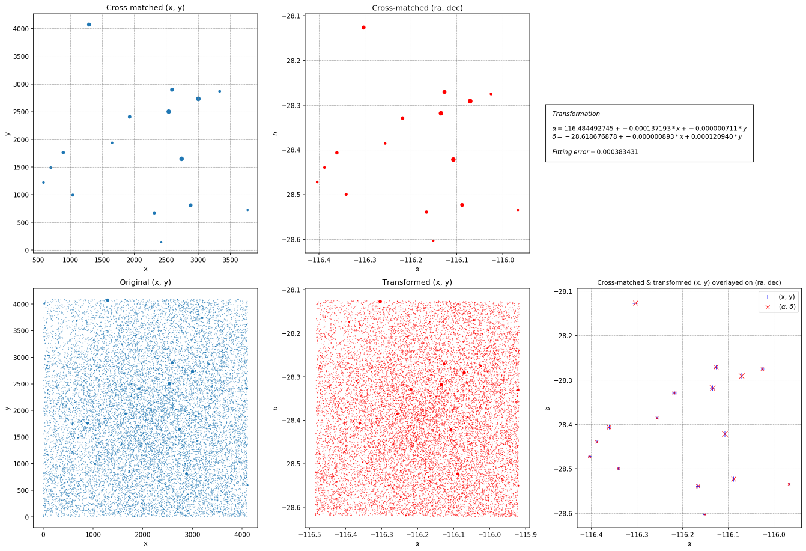

# astrometry

Takes an input data file with (x,y) coordinates and assigns (alpha, delta)
astrometry, given a `*_corr.fits` file previously obtained from the
[astrometry.net](http://nova.astrometry.net/) service.

The algorithm used to transform `(x,y)-->(ra,dec)` is the one [developed by Jarno Elonen](https://elonen.iki.fi/code/misc-notes/affine-fit/), based on the article [Fitting affine and orthogonal transformations between two sets of points](https://hrcak.srce.hr/712), H. Späth (2004).

It can also work with a list of stars manually cross-matched and stored
in a `*_corr.fits` file with column names:

    field_ra, field_dec, field_x, field_y

It can also generate the file needed to feed the `astrometry.net` service.

The `astrometry.net` takes its coordinated from the [USNO-B catalog](http://tdc-www.harvard.edu/catalogs/ub1.html) which:

> ...is believed to provide all-sky coverage, completeness down to V = 21, 0.2 arcsecond astrometric accuracy at **J2000**

## Requirements

    Python 3, astropy, numpy scipy, matplotlib
